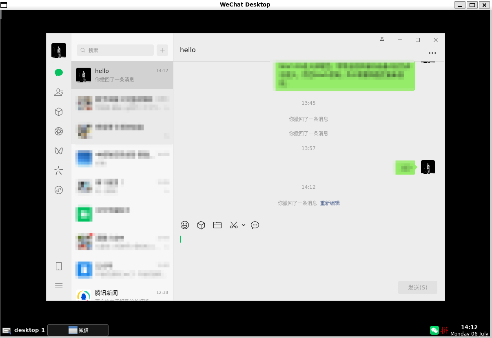
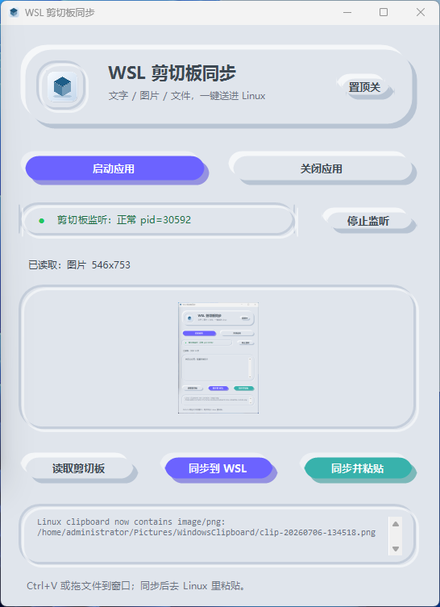
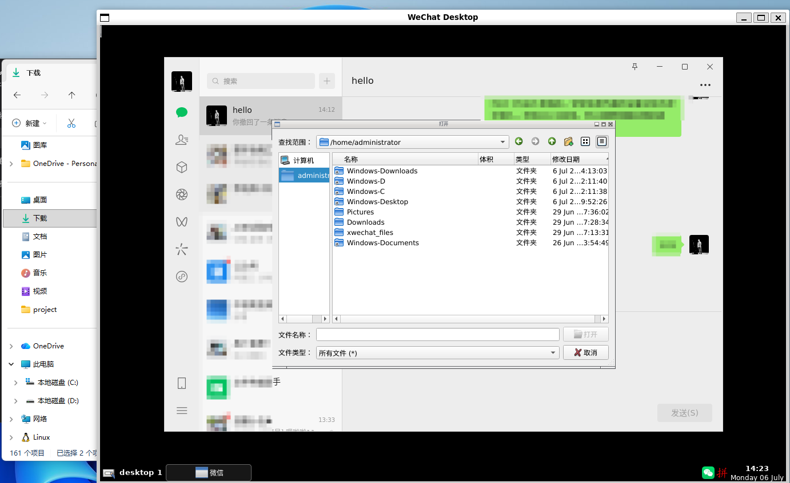

# WSL WeChat Bridge ✨

> 在 Windows 上不直接装微信，也能拥有接近原生微信的 Linux 微信体验。


如果你的 Windows 电脑不方便安装微信，或者你不希望 Windows 本机环境里出现微信痕迹，可以试试这套方案。

它的思路很简单：**微信不装在 Windows 本机，而是装在 WSL2 虚拟化 Linux 环境里**。项目会给 Linux 微信套一个独立窗口，再用自写的消息提醒桥、焦点桥、剪切板桥和桌面小组件，把体验尽量补到接近 Windows 原生微信。

一句话：**Windows 里看起来像有一个微信窗口，实际运行在 Linux/WSL 里。**

本项目不包含、也不分发微信安装包。Linux 微信请从官方页面获取：

```text
https://linux.weixin.qq.com/
```

## 为什么会有这个项目

Windows 微信有时不方便装，原因可能很多：

- 工作电脑/远程电脑不适合直接安装微信；
- 不希望 Windows 开始菜单、搜索、应用列表里出现微信；
- 因为隐私原因，想把微信和主系统隔离一下；
- 已经在用 WSL，希望顺手把 Linux 微信也跑起来；
- Windows 和 Linux 微信之间复制粘贴太痛苦，想要一个顺手的桥。

所以这个项目做的是一件偏“符合中国宝宝体质”的事：让国内用户在 Windows 上用 WSL 跑 Linux 微信，同时把复制粘贴、启动关闭、消息提醒这些日常体验补齐。

## 它能做到什么

### 独立 Linux 微信窗口

Linux 微信运行在一个嵌套桌面里，有自己的窗口。你平时就像切到普通 Windows 微信一样使用它，但它实际不在 Windows 本机应用环境中。



窗口外层是 WSL/X11 嵌套桌面，里面运行的是官方 Linux 微信。你在 Windows 上看到的是一个普通窗口，但微信进程和文件环境都在 WSL 里。

嵌套桌面固定为单工作区 `desktop1`。openbox 会被启动在私有单桌面配置下，并把当前会话的桌面数压到 1，避免鼠标滚轮误切到 `desktop2-4` 后找不到微信窗口。

### 中文输入法

新装的 WSL/Ubuntu 通常没有可直接给 Linux GUI 应用使用的中文输入法。项目会在启动 Linux 微信时设置 fcitx5 相关环境变量并启动 fcitx5，但安装环境里仍然需要有中文输入法引擎，例如 `fcitx5-chinese-addons` 和 `fcitx5-pinyin`。

如果 Linux 微信里不能输入中文，优先让 agent 检查并安装这些包，而不是先怀疑微信本身。

### Windows 桌面小组件

小组件可以读取 Windows 剪切板里的：

- 文字；
- 图片；
- 文件。

然后一键同步到 WSL/Linux 微信里。小组件分成“剪贴板”和“运行状态”两页：剪贴板页负责预览/编辑内容并同步到 WSL，运行状态页负责看统一监听、最近操作输出和手动启停监听；“运行状态”页签上的小圆点会直接显示监听状态，黄代表未监听，绿代表正常。你也可以把它当作日常主操作入口：在这里启动/关闭 WSL 微信，读取 Windows 剪切板，把内容同步进 Linux 微信，也可以手动把 WSL/Linux 文本剪切板拉回 Windows。



剪贴板页底部只保留两颗主按钮，并排放在同一行：`同步到 WSL` 和 `读取WSL剪切板`。小组件适合处理 Windows -> Linux 微信的主动同步：复制文字、图片或文件后，点一下“同步到 WSL”，再切到 Linux 微信里粘贴。需要把 Linux/WSL 里的文本拉回 Windows 时，就在同一行点“读取WSL剪切板”，在自动监听偶发延迟时手动补一次。

### 统一剪切板监听

项目使用一个统一监听来处理常见双向同步：

- Windows 图片/文件剪切板 -> Linux 微信；
- Linux/X11 文本剪切板 -> Windows。

Windows 文本 -> Linux 微信默认走小组件里的“同步到 WSL”按钮，或者手动运行 `winclip2wechat`。Linux/WSL 文本 -> Windows 可以走统一监听，也可以在小组件剪贴板页点“读取WSL剪切板”，等价于手动运行 `wechatclip2win`。这样做是为了避免两个系统互相监听文本后出现循环同步、抢剪切板、越用越乱。

它不会再额外启动单独的 `wechatclip2win --watch`，统一监听就是唯一的自动监听。

### 直接读写 Windows 文件

安装器会在 WSL 用户目录下创建一些 Windows 文件入口，例如：

- `~/Windows-C`
- `~/Windows-D`
- `~/Windows-Desktop`
- `~/Windows-Downloads`
- `~/Windows-Documents`



这样你在 Linux 微信里点“发送文件”时，可以直接从这些入口选择 Windows 磁盘上的文件，不需要先复制到 Linux 目录。反过来，接收文件、另存为图片或保存资料时，也可以直接保存到这些 Windows 目录里，让 WSL 微信和 Windows 文件系统之间来回传文件更顺手。

### 消息提醒和焦点桥

Linux 微信有些消息不会天然出现在 Windows 通知里。本项目包含一套本地桥接脚本，用来尽量转发 Linux 通知信号，并处理“微信以为自己一直在前台”导致不提醒的问题。默认只让 Windows 任务栏里的 WeChat Desktop 闪烁，不弹出额外消息窗口；如果需要右下角弹窗，可以在小组件里勾选“消息弹窗”。

默认通知路径只使用 D-Bus 通知、X11 attention、窗口标题里的未读信号等低成本信号。实验性的未读角标截图 watcher 默认关闭，需要在配置里显式开启。

提醒能力会受 Linux 微信自身行为影响，不保证所有场景都能 100% 等同原生 Windows 微信，但目标是让日常体验尽量接近。

## 适用场景

这个项目尤其适合：

- Windows 电脑不方便安装微信；
- 想让微信运行在 WSL/Linux 隔离环境中；
- 希望新装 WSL 也能在 Linux 微信里正常输入中文；
- 希望 Windows 搜索和开始菜单里尽量不体现 WeChat/微信；
- 希望 Linux 微信复制出来的文字能直接到 Windows；
- 希望 Windows 复制的文字、图片、文件能送进 Linux 微信；
- 希望 Linux 微信发送/保存文件时能直接使用 Windows 磁盘目录；
- 愿意折腾一点点 WSL，但希望日常使用足够顺手。

不太适合：

- 完全不想接触 WSL；
- 期待 100% 原生 Windows 微信体验；
- 需要企业级稳定通知保证；
- 不愿意让 agent 或脚本在本机执行安装检查。

## 已知问题

- 消息提醒不稳定：通知桥会尽量捕获 Linux 微信的 D-Bus 通知、X11 attention、窗口标题变化等信号，但 Linux 微信并不总是为真实消息发出这些信号。因此 Windows 任务栏闪烁和可选消息弹窗属于 best-effort 能力，不保证每台机器、每类消息都稳定触发。

## 更新记录

### 2026-07-15

今天主要更新了这几块：

- 小组件改成“剪贴板 / 运行状态”两页，运行状态页签会用黄/绿小圆点显示监听是否正常。
- 剪贴板页底部只保留 `同步到 WSL` 和 `读取WSL剪切板` 两个按钮，并排放在同一行。
- WSL 里的 Linux 微信桌面固定为 `desktop1`，避免鼠标滚轮误切到 `desktop2-4` 后找不到微信窗口。
- 默认通知、焦点桥、剪切板同步和日志隐私做了一轮加固，减少误提醒、抢剪切板和敏感内容落日志的风险。
- 安装脚本和本地启动文件已同步更新，桌面快捷方式会打开新版小组件。

## Agent 一键安装 🪄

如果你使用 Codex、Claude Code、Cursor Agent 之类的本地 agent，可以直接把下面这段话复制给它。

```text
请从 https://github.com/yzmw123/wsl-wechat-bridge 在我的 Windows 电脑上安装 WSL WeChat Bridge。

请先阅读并遵循完整 Agent 安装提示词：
https://github.com/yzmw123/wsl-wechat-bridge/blob/main/docs/AGENT_INSTALL_PROMPT.md

先检查我的 WSL2 和可用的 Ubuntu 发行版是否已经安装。如果 WSL 没装，或者需要启用 Windows 功能、重启、管理员权限，请先说明需要做什么并征求我的确认。若 WSL 已可用，请安装或复用 Ubuntu-22.04 或其他 Ubuntu 发行版，从 https://linux.weixin.qq.com/ 下载并安装最新的官方 Linux 微信，然后安装这个 bridge 项目。

安装完成后，运行 scripts/doctor.ps1 做体检；通过 bridge 启动 Linux 微信，确认 Linux 微信里可以输入中文，打开 Windows 剪切板小组件，验证 Windows 到 WSL 的剪切板同步、Linux 微信到 Windows 的文本同步，以及 Linux 微信能否从 ~/Windows-Downloads 这类入口直接选择和保存 Windows 文件，最后只把日常常用命令告诉我。不要使用非官方微信安装包，除非我明确同意。
```

完整 agent 安装提示词见：[docs/AGENT_INSTALL_PROMPT.md](docs/AGENT_INSTALL_PROMPT.md)

## 手动安装

前提：

- Windows 11；
- 已安装 WSL2；
- 有一个 Ubuntu 发行版，例如 `Ubuntu-22.04`；
- Linux 微信已经安装在该 WSL 发行版中；
- WSL 里具备必要依赖，例如 `x11-utils`、`x11-apps`、`xclip`、`wmctrl`、`xdotool`、`xserver-xephyr`、`openbox`、`tint2`、`dbus-x11`、`fcitx5`、`fcitx5-chinese-addons`、`fcitx5-pinyin`、`python3`、`python3-dbus`、`python3-gi`。

安装项目：

```powershell
cd path\to\wsl-wechat-bridge
powershell -ExecutionPolicy Bypass -File .\scripts\install.ps1 -Distro Ubuntu-22.04
```

如果希望安装脚本顺手尝试安装 WSL 里的依赖，可以加上：

```powershell
powershell -ExecutionPolicy Bypass -File .\scripts\install.ps1 -Distro Ubuntu-22.04 -InstallDependencies
```

安装脚本会把 Windows 辅助文件复制到：

```powershell
%LOCALAPPDATA%\WslPrivate\launchers
```

并把 WSL 侧命令安装到：

```text
/usr/local/bin
```

默认还会创建桌面快捷方式：

```text
WSL剪切板同步.lnk
```

安装器也会在 WSL 用户目录下创建 `~/Windows-C`、`~/Windows-D`、`~/Windows-Downloads` 等链接，方便 Linux 微信直接选择 Windows 磁盘文件发送，也方便把接收文件保存回 Windows 目录。

安装后可以跑一次体检：

```powershell
powershell -ExecutionPolicy Bypass -File .\scripts\doctor.ps1 -Distro Ubuntu-22.04
```

如果官方 Linux 微信不叫 `wechat`，可以在 WSL 里创建配置：

```bash
mkdir -p ~/.config/wsl-wechat-bridge
printf 'WECHAT_COMMAND=/path/to/wechat\n' > ~/.config/wsl-wechat-bridge/config
```

同一个配置文件还支持这些开关：

```text
# 默认 1；设为 0 可禁止自动启动对应 helper
NOTICE_BRIDGE_ENABLED=1
FOCUS_WATCH_ENABLED=1
CLIPBOARD_WATCH_ENABLED=1

# 默认 0；实验性角标截图 watcher，显式开启后才随 wechat-desktop 启动
BADGE_WATCH_ENABLED=0
BADGE_WATCH_POLL_SECONDS=3
BADGE_WATCH_IDLE_POLL_SECONDS=10

# 默认 5MB、保留 2 份轮转日志；剪贴板临时载荷默认 1 小时 TTL
WSL_WECHAT_LOG_MAX_BYTES=5242880
WSL_WECHAT_LOG_BACKUPS=2
WSL_WECHAT_CLIPBOARD_TTL_SECONDS=3600
```

## 日常命令

启动 Linux 微信：

```powershell
wsl -d Ubuntu-22.04 -- wechat-desktop
```

查看状态：

```powershell
wsl -d Ubuntu-22.04 -- wechat-desktop-status
```

正常关闭：

```powershell
wsl -d Ubuntu-22.04 -- wechat-desktop-stop
```

普通关闭只发送 `SIGTERM`。如果仍有进程存活，它会提示并返回非零，不会直接强杀。

强制关闭：

```powershell
wsl -d Ubuntu-22.04 -- wechat-desktop-stop --force
```

打开桌面小组件：

```powershell
wscript.exe //B "$env:LOCALAPPDATA\WslPrivate\launchers\start-clipboard-widget-hidden.vbs"
```

查看统一剪切板监听状态：

```powershell
powershell -NoProfile -STA -ExecutionPolicy Bypass -File "$env:LOCALAPPDATA\WslPrivate\launchers\clipboard-watch.ps1" -Status
```

## 项目结构

```text
app/
  linux/bin/        安装到 WSL /usr/local/bin 的命令
  windows/          WinForms 小组件、监听脚本、图标、Windows 辅助脚本
  windows/launchers 隐藏启动用的 VBS/CMD 入口
docs/               文档
scripts/install.ps1 安装脚本
skills/             可选 Codex 维护 skill
```

## 小组件和 Skill 的关系

普通用户只需要小组件和安装脚本，不需要 skill。

`skills/wsl-wechat-helper` 是给 Codex 或其他维护 agent 用的“维修手册”。它记录了本地架构、排障命令、已知坑和安全规则。保留它的好处是：后续如果某台机器剪切板、通知、焦点桥坏了，agent 能更快定位问题。

简单说：

- 小组件：给人用；
- skill：给 agent 维修用。

## Star 一下吧 ⭐

如果这个项目刚好解决了你的问题，欢迎点一个 Star。

这会直接影响我后续有没有动力继续维护，比如继续优化通知、剪切板、安装流程、更多发行版适配，以及把小组件做得更好看一点。

## 隐私说明

本项目的日志只应记录运行状态，例如进程号、字节数、hash、启动状态等；不应主动记录剪切板正文、微信消息正文、Windows 前台窗口标题或通知摘要。

剪切板同步需要短时间保留 xclip/wl-copy 可读取的源载荷。当前实现会把这些临时文件放在权限受限的 runtime/cache 目录中，并按 `WSL_WECHAT_CLIPBOARD_TTL_SECONDS` 清理；默认命令输出也不会打印 Windows 文件路径。需要排障时，可以临时设置 `WSL_WECHAT_VERBOSE_CLIPBOARD=1` 打印路径。

使用前仍建议你自行审阅代码，尤其是在处理敏感账号或敏感文件时。
